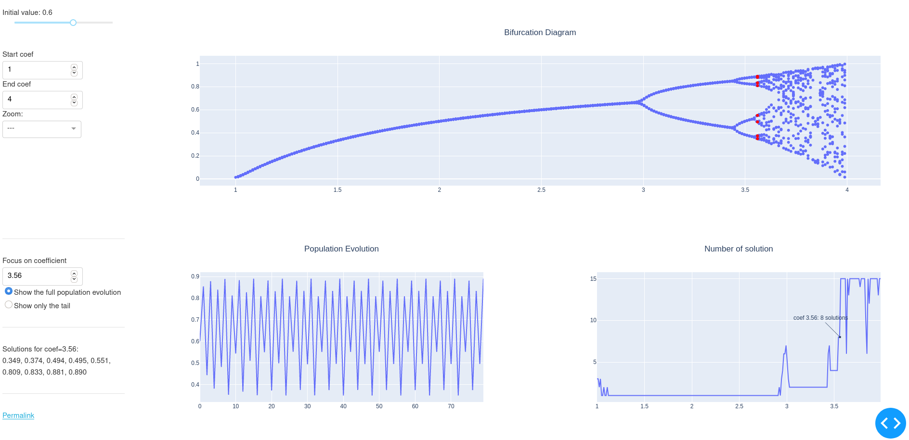

Bifurcation diagram playground
==============================

Toy code for playing with Dash+Plotly frameworks, based on the
bifurcation diagram. See
[Veritasium video](https://www.youtube.com/watch?v=ovJcsL7vyrk) *“This
equation will change how you see the world”* for more info about the context.

Try it
------

    pipenv run ./bifurq.py

or

    pip install dash==1.8.0
    python3.7 ./bifurq.py

Tutorial
---------

[Dash+Plotly tutorial presentation](tutorial.pdf) at the Grenoble Python User
Group
[meeting](https://www.meetup.com/Groupe-dutilisateurs-Python-Grenoble/events/268250931/)
of February, 18th 2020:

- Dash+Plotly introduction
- Bifurcation diagram presentation
- 3 callbacks illustrated
- 2 exercises

For the exercises, look at the branches of this repository:

> base --> ex1 --> ex2 --> permalink -...-> master

Screenshot
----------

